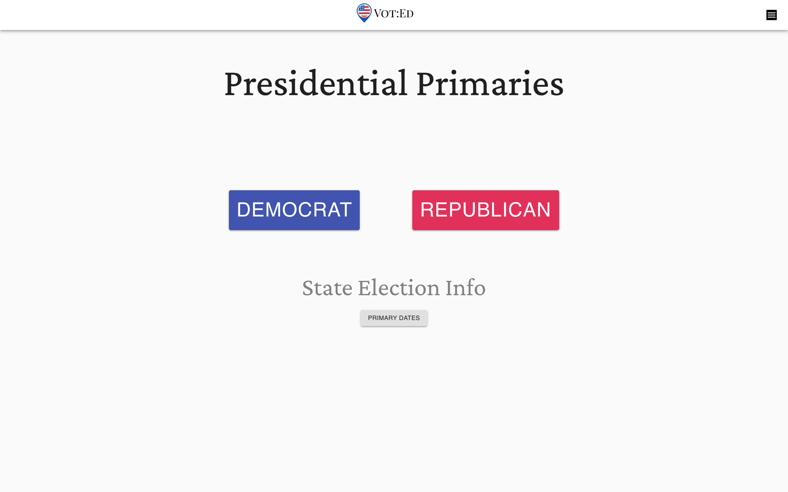
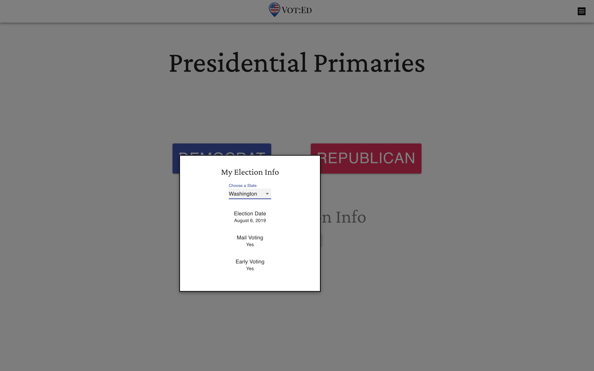
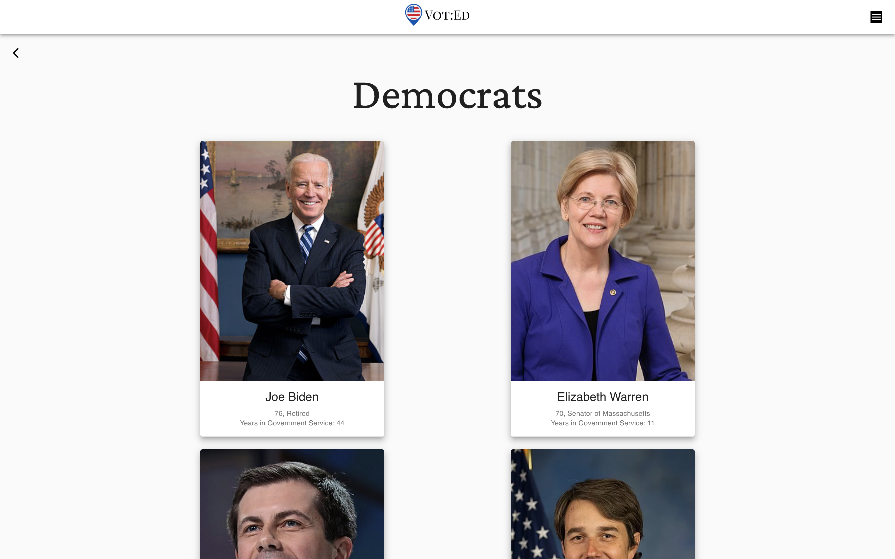
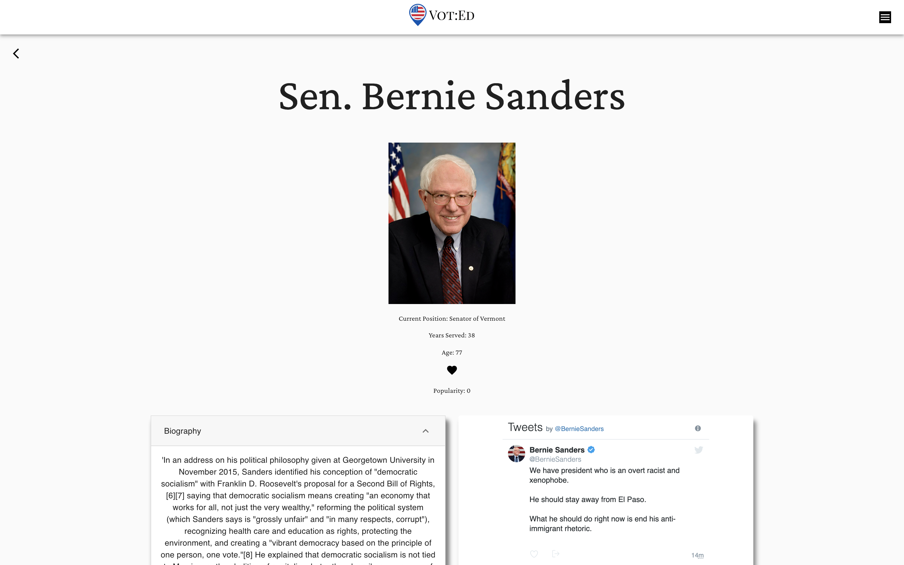
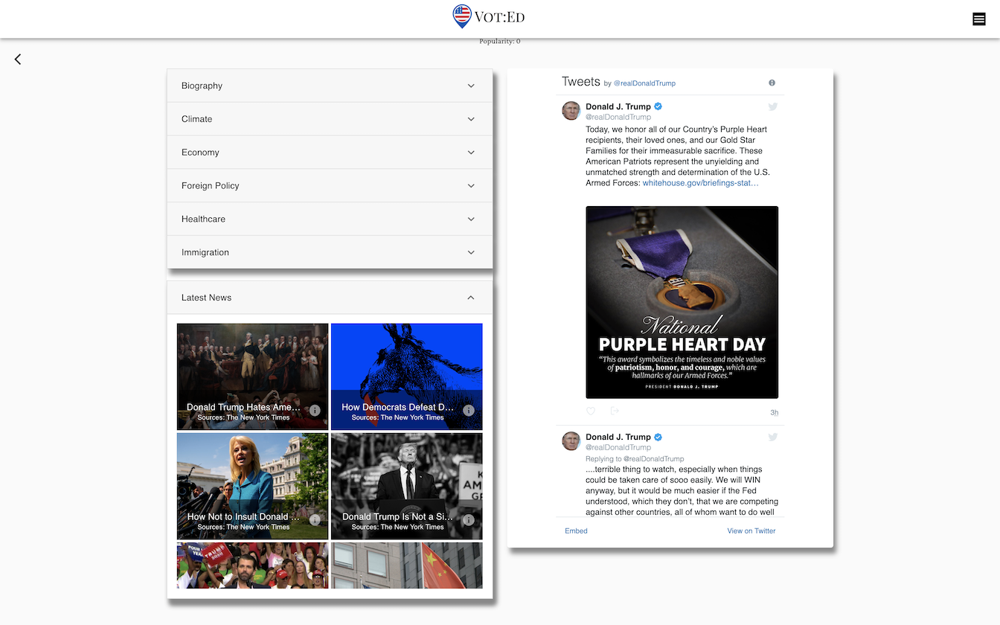
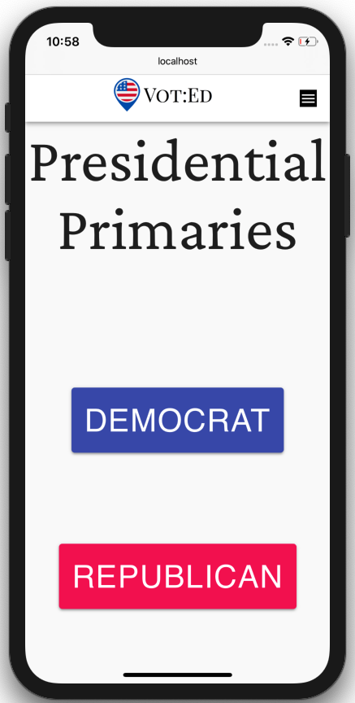

# VOT:ED

## Background
The US voter turnout ranks 31 out of 35 developed Countries. A recent study showed that 1 in 4 eligible voters had not even registered to vote. A common reason for that is because voters simply do not know who they are voting for and thus require research on the candidates.

Voter education means providing citizens of a democracy with basic information about participating in elections. Voter education is often provided by the state itself, often through a national electoral commission, so it is therefore important that it is politically non-partisan. Government departments that focus on voter education are often highly scrutinized by a third party. 

## Overview
VOT:ED is a platform for voters to research and get educated on the upcoming Primary Election. We want to be a "one stop shop" for voters to research and get educated on all the candidates. Our aim is to be un-biased by providing news from all sources on the web.

This application was bootstrapped with [Create React App](https://github.com/facebook/create-react-app). The backend was built using Nodejs, Express, MongoDB, and various APIs (NewsAPI & Twitter).

You can check out the here
[Live Demo](https://kdublam.github.io/clicky-game/)!

## Tech Used
- React
- Nodejs
- Express
- MongoDB
- Passport
- Material UI
- NewsAPI
- Twitter API

## Screenshots

#### Desktop page

#### Mobile page

## Getting Started

### Available Scripts

In the project directory, you can run:

### `npm start`

Runs the app in the development mode. 
Open [http://localhost:3000](http://localhost:3000) to view it in the browser.

The page will reload if you make edits. 
You will also see any lint errors in the console.

### `npm test`

Launches the test runner in the interactive watch mode. 
See the section about [running tests](https://facebook.github.io/create-react-app/docs/running-tests) for more information.

### `npm run build`

Builds the app for production to the `build` folder. 
It correctly bundles React in production mode and optimizes the build for the best performance.

The build is minified and the filenames include the hashes. 
Your app is ready to be deployed!

See the section about [deployment](https://facebook.github.io/create-react-app/docs/deployment) for more information.

## Deployment

See how you can deploy this React app [here](https://github.com/gitname/react-gh-pages)

